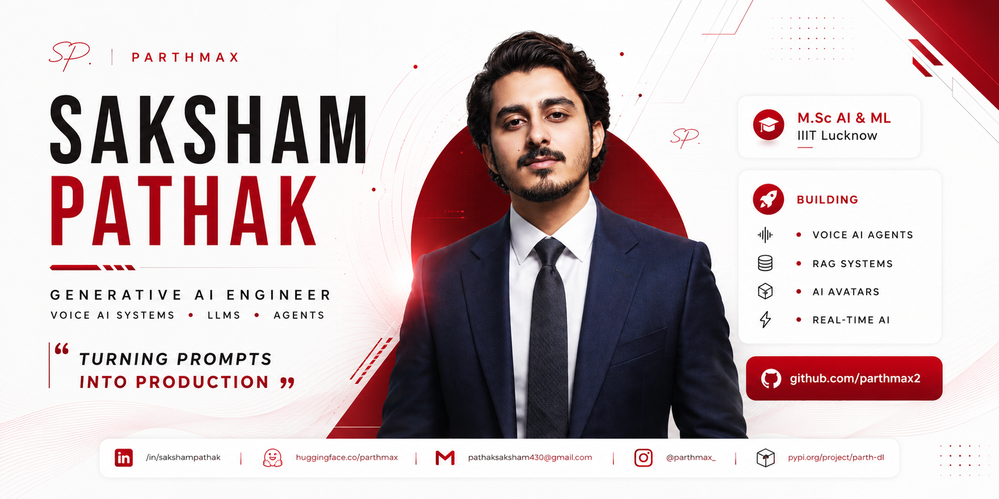

 

---
<table>
<tr>

<td width="58%" valign="top">

## About Me

I'm **Saksham Pathak**, an AI Engineer and M.Sc. AI & ML student at IIIT Lucknow, focused on building intelligent systems that can listen, reason, retrieve knowledge, and take action.

My work spans **Voice AI, LLM Agents, RAG Pipelines, Fine-Tuning, and AI Automation**, with a strong interest in creating real-time AI experiences that feel natural and human.

Currently, I'm exploring:

* 🎙️ Barge-in Voice Agents & Conversational AI
* 🧠 Tool-Enabled LLM Systems and Agent Workflows
* 📚 Retrieval-Augmented Generation (RAG)
* 🤖 AI-Powered CRM & Business Automation
* 🎭 Real-Time 3D Conversational Avatars

I enjoy turning ambitious AI ideas into practical systems that people can interact with, trust, and use every day.

</td>

<td width="42%" align="center">

<video width="100%" controls>
  <source src="https://raw.githubusercontent.com/parthmax2/parthmax2/main/about.webm" type="video/webm">
</video>

### Project JARVIS

*Voice → Reasoning → Action*

</td>

</tr>
</table>

---

## ARSENAL

| Domain | Stack |
|:--|:--|
| **Voice AI** | Whisper · Deepgram · WebRTC · VAD · STT / TTS · Twilio |
| **LLM & Agents** | LangChain · LangGraph · LlamaIndex · OpenAI · HuggingFace |
| **Training** | PyTorch · LoRA · QLoRA · PEFT · Transformers |
| **RAG & Vector** | FAISS · ChromaDB · Pinecone · Semantic Retrieval |
| **Infra** | FastAPI · Docker · GCP Cloud Run · Vercel |

---

## SYSTEMS

**`01` — Real-Time 3D Conversational Avatar**
Speech → LLM → TTS with sub-second latency and neural lip-sync.
`PyTorch` `WebRTC` `TTS` `3D`

**`02` — DocuMind AI · Document Intelligence**
Q&A across massive document collections. Semantic chunking + vector-backed retrieval.
`LangChain` `FAISS` `ChromaDB` `FastAPI` · 

**`03` — FALCON · AI Fake News Detector**
Multi-stage fact-checking pipeline: classify → verify → explain.
`LangChain` `OpenAI` `FastAPI` · 

**`04` — parth-dl · Open Source CLI**
Zero-dependency Instagram media downloader. No login, no API key. Published on PyPI.
`Python` `CLI` ·  

**`05` — 100 Best GenAI Projects 2025**
Curated 100+ high-impact open-source LLM, RAG & Agent projects.
`LLM` `RAG` `Agents` · 

---

## STATS

&nbsp;

---

*"The goal isn't to build models. The goal is to build intelligence that matters."*

